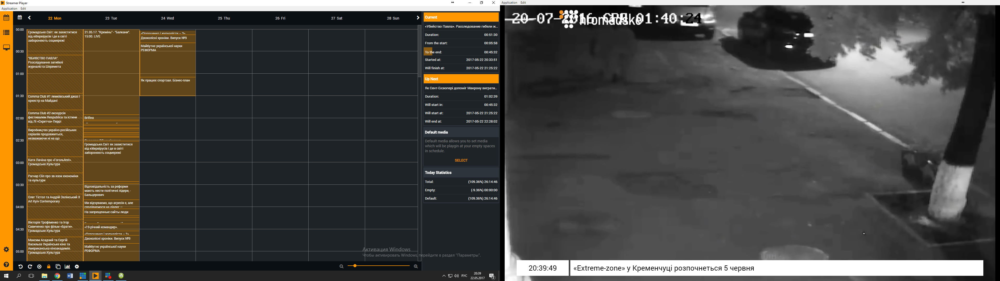
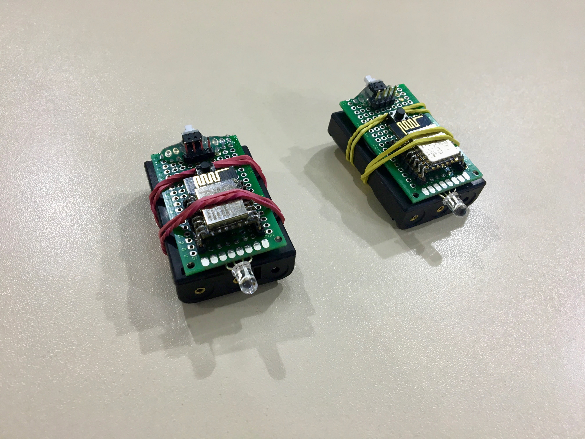

## About Me

I am an experienced programmer with a passion for building products. I have been programming since the age of 14, starting with C++ and later writing firmware for microcontrollers using assembler. I then transitioned to writing drivers with Delphi and eventually landed my first job as a C# developer. I also have experience as an iOS developer, and I am currently working as a full-stack developer.

## Education

### Kremenchuk Mykhailo Ostohradskyi National University

Master’s degree, Systems Engineering

**Period:** 2011 - 2015

**Major:** Computer sience

**Country:** Ukraine

### College of Kremenchuk National University

Junior specialist, Computer Science

**Period:** 2007 - 2011

**Country:** Ukraine

## Experience

### 🇺🇸 CircleOf - Full-stack developer

**Period:** July 2017 - Now (6 years)

**Technologies:** React, React Native, NodeJS, TypeScript, MySQL, Gatsby, Tailwind CSS

**Country:** United States

**Links:** [App Store](https://apps.apple.com/app/1298712207), [Google Play](https://play.google.com/store/apps/details?id=com.mywaysmobile), [Website](https://circleof.com/).

CircleOf is an application designed to organize assistance for individuals with health problems. It facilitates the creation of a support group comprised of family, friends, and colleagues. Once this group is established, you can add various events to the calendar, offer help, and communicate with group members. Companies can also participate in the partnership program to offer aid to their employees. Additionally, the project includes a website that publishes various tips for caring for those in need.

In the early stages of the project, I was responsible for the mobile application, which was developed using React Native. As the project evolved, all the code was eventually rewritten in TypeScript.

Subsequently, a website was developed using React and Gatsby. All content on the site is managed using GatherContent.

**Results:** apps in the [App Store](https://apps.apple.com/ua/app/family-caregiving-circleof/id1298712207), [Google Play](https://play.google.com/store/apps/details?id=com.mywaysmobile) and a [website](https://circleof.com/).


  
  
  
  
  
  
  
  
  
  
  


### 🇺🇸 Watery - Full-stack developer

**Period:** June 2021 - August 2022 (1 year, 2 months)

**Thechnologies:** React, TypeScript, NodeJS, PostgreSQL, AWS Lambda, AWS EC2, AWS S3, AWS Route53, AWS CloudFront, AWS RDS, AWS SNS

**Country:** United States

**Links:** [Website](https://watery.com/)

Watery is a website specializing in real estate located near water. With its search function, you can find listings in a selected city that meet specific criteria, such as the number of bedrooms and bathrooms, among others.

The front-end was developed using React, while NodeJS was used for the back end. To generate the list of offers, data from the provider is utilized, which is imported every night. The application actively uses various AWS services, including EC2, Lambda, S3, Route53, CloudFront, RDS, and SNS.

**Results:** the application is launched in production.


  
  
  


### 🇺🇸 Iris - Full-stack developer

**Period:** Februrary 2021 - June 2021 (4 months)

**Thechnologies:** React, TypeScript, NodeJS, PostgreSQL, AWS Lambda, AWS S3, AWS Cognito, AWS EC2

**Country:** United States

Iris is a new system designed for organizing large online events. The idea originated from the company that organized offline events. With mass gatherings banned during the pandemic, the company decided to transition to an online platform.

The system is composed of two parts. The first is designed for event management, which includes tasks such as video and sound editing, schedule modification, and so on. The second part caters to visitors, facilitating the creation of a landing page for the event, ticket sales, and the publishing of schedules.

Initially, I was brought on board as a front-end developer using React. Later, I assumed the roles of a back-end developer and system architect. The complexity of the project lay in the volume of required functionality and data architecture. This initially posed challenges for the designers, as they struggled to envision a clear product concept. I assisted in understanding the product's functionality, prioritizing features, and creating wireframes for the designers.

### 🇬🇧 Flow - React Native developer

**Period:** June 2021 - January 2022 (8 months)

**Thechnologies:** React Native, JavaScript, TypeScript, Expo

**Country:** United Kingdom

**Links:** [App Store](https://apps.apple.com/app/1560246719), [Google Play](https://play.google.com/store/apps/details?id=co.flowplaces), [Website](https://www.flowplaces.co)

Flow is an application that facilitates booking spaces in coworking locations or offices in London. The system is fully automated; users simply select a location, book for a specific time or day, and scan the QR code at reception.

When I joined the startup, it was in its early stages with the application existing only as a prototype. My task was to transform this prototype into a full-fledged application and launch it on both the App Store and Google Play. I rewrote the application in TypeScript from JavaScript, altered the design to align with the brand book, and incorporated the ability to process payments through Stripe.

**Results:** the app was published in the [App Store](https://apps.apple.com/app/1560246719) and [Google Play](https://play.google.com/store/apps/details?id=co.flowplaces), and the project was successfully launched.


  
  
  
  
  
  
  


### 🇺🇸 Captains Club - React Native developer

**Period:** Februrary 2020 - December 2021 (1 year, 11 months)

**Thechnologies:** React, React Native, TypeScript, NodeJS

**Country:** United States

**Links:** [App Store](https://apps.apple.com/app/1502096463), [Google Play](https://play.google.com/store/apps/details?id=club.captains.mobile&hl=en&gl=US)**,** [Website](http://app.captains.club/)

Captains Club is an exclusive social network for golfers. It enables users to track their friends' progress, organize and invite friends to events, and engage in discussions through messages and comments.

When I joined the project, it only had a web application, which was written in React and JavaScript. My task was to develop iOS and Android applications using React Native, in accordance with the project's brand book.

**Results:** apps in the [App Store](https://apps.apple.com/app/1502096463) and [Google Play](https://play.google.com/store/apps/details?id=club.captains.mobile&hl=en&gl=US).


  
  
  


### 🇺🇸 Nevados - front-end developer

**Period:** Feburary 2019 - December 2019 (11 months)

**Thechnologies:** React, React Native, TypeScript, NodeJS

**Country:** United States

**Links:** [Website](https://nevados.co/)

Nevados is a system for creating and managing solar power plants. It is comprised of two parts: hardware that physically adjusts the angle and rotation of solar panels, and software for remote control. Customers can register in the system, then use a map to delineate their site. Subsequently, an algorithm calculates the optimal placement, orientation, and quantity of the panels.

The main challenge lay in developing an algorithm to compute the optimal positions. All calculations occur directly in the browser and are written in TypeScript. I designed an algorithm that, utilizing extensive geometry, performed all the necessary computations.

Additionally, I created a mobile application in React Native. This app allows operators to scan the QR code on the solar panel control device, adding it to their control system.

**Results:** the system was put into operation and the mobile application was published on Google Play.


  
  
  
  
  


### 🇺🇸 Pando - Software engineer

**Period:** March 2016 - November 2018 (2 years, 9 months)

**Technologies:** AngularJS, NodeJS, Raspberry, RabbitMQ, AWS, Raspbian.

**Country:** United States

**Links:** [Website](http://getpando.com/)

Pando is a device, based on Raspberry Pi, that can be connected to a screen to customize the content displayed on it through a web panel. The device also includes a WiFi module that scans the surrounding environment and analyzes the number of active devices in its vicinity. Its primary applications are in shops and shopping centers.

I was responsible for writing the code to control the device and creating a web-based control panel using AngularJS. The Raspberry Pi, being relatively underpowered for media operations, posed some challenges. Playing content in a browser led to video glitches and freezes, necessitating optimization of the Raspbian operating system for improved media playback.

Another challenge was updating the device's firmware. We needed to prevent any new updates from breaking the device and rendering it inoperative, as this would require us to manually download the new firmware onto all customer devices. As a result, special attention was devoted to the update process. We devised a system that downloads and runs new firmware, but reverts to the previous version in case of critical errors.

**Results:** the project was finalized and successfully launched.


  
  
  
  
  
  


### 🇺🇦 Hromadske.Kremenchuk - CTO

**Period:** April 2014 - May 2017 (3 years, 1 month)

**Technologies:** React, Angular, NodeJS, MongoDB, Redis, TypeScript, Electron, C++, PHP, WordPress, Nginx, RTMP.

**Country:** Ukraine

Громадське Телебачення - громадська організація, яка виникла у кінці 2013 і основною ціллю якої було правдиве висвітлення подій з урахуванням всіх журналістських стандартів. Саме для цього був обраний формат “громадської організації”, щоб мати змогу фінансуватись за рахунок донатів та грантів. Особливої популярності телебачення набуло під час Революції Гідності в Україні в 2014 році. Спочатку, організація була заснована в Києві, а потім було прийняте рішення створити незалежні регіональні відділення, в тому числі і в Кременчуці.

Я був запрошений у якості СТО щоб створити телестудію та всю інфраструктуру з нуля. У нас був дуже маленький бюджет. Зазвичай телестудію будують на основі спеціалізованих пристроїв. Наприклад, перемикання камер, запуск відео в ефір, бігуча стрічка, зідзвони в Skype, видача відеопотоку в Інтернет - для цього всього використовується окремі пристрої. Але у нас не було для цього бюджету. Тому було прийнято рішення по максимуму все замінити програмними рішеннями. В результаті перший варіант студії прямого мовлення складавася всього лише з одного комп’ютера з картою захоплення відеопотоку, камер і звукового мікшеру.

Я створив нашу власну веб-систему менеджменту телестудії, до функцій якої входило:

- Генерація титрів для ефіру з нашим брендовим дизайном і базою людей, котрі відвідували наш ефір.
- Бігуча стрічка, котра постійно прокручувалась в ефірі. Журналісти мали змогу віддалено її редагувати, а вона автоматично оновлювалась через WebSockets.
- Публікатор новин в соціальні мережі. Журналісти мали змогу підготувати новину і за допомогою одного кліка запостити її у всі соціальні мережі де було присутнє Громадське Телебачення.

Серверна частина додатку була написана на NodeJS з використанням фреймворку Sails.js. Front-end написаний на AngularJS.

Пізніше я створив спеціальний окремий додаток на Electron - Streamer, за допомогою якого можна було формувати ефір телебачення. Він складався з двох вікон. Перше вікно у вигляді календаря, в котрому можна досить просто додавати відео, прямі включення, рекламу і бачити, що зараз відтворюється в ефірі. У другому - вікно відтворення ефіру, котра потім захвачувалось комп’ютером і стрімилось в ефір.

Також, для економії, я створював власні пристрої. Наприклад пристрій для підсвічування активної камери. Коли режисер ефіру вмикає якусь камеру в ефір, над нею загоряється червоний світлодіод і журналісти знають куди їм зараз треба дивитись. На ринку такі пристрої коштують $200 - $300. Наші коштували $10.

 була створена телестудія з нуля за значно менший кошт. Мною була зібрана студія і налаштовані процеси та процедури роботи технічної команди. Був створений сайт телебачення та система менеджменту прямого ефіру.

### 🇺🇦 Visnyk Kremenchuka - iOS, PHP developer

**Period:** September 2012 - May 2014 (1 year, 8 months)

**Technologies:** iOS, Objective-C, Wordpress, PHP, MySQL

**Country:** Ukraine

The Visnyk Kremenchuka is a media outlet based in the city of Kremenchuk. At the inception of our collaboration, they were publishing a weekly paper newspaper and maintaining a website. However, as the influence of the internet grew, they found their paper edition sales declining while their website readership expanded. Consequently, they decided to prioritize their online presence.

Initially, I transitioned the site to WordPress from an outdated CMS that hadn't been updated in a while. Switching to WordPress facilitated more attractive content creation, simplified news editing, enhanced content management, and enabled analytics. For load balancing, Apache and Nginx were used, and we introduced the capability to cache pages into static files.

Subsequently, the editorial team decided to develop an iOS application. Its core functions included news reading, the ability to leave comments, viewing photos and videos, and saving favorite content. To accomplish this, I developed the application in Objective-C and integrated it with the existing site using the WordPress API and my custom plugins.

**Results:** the website loading speed increased four times. The app was published in the App Store and had about a thousand users.


  
  
  
  
  
  
  
  
  
  
  
  
  
  
  


### 🇺🇦 RiverSoft - Delphi, C# developer

**Period:** March 2010 - May 2012 (2 years, 2 months)

**Technologies:** Delphi, C#, WPF, Microsoft SQL Server

**Country:** Ukraine

RiverSoft is a company specializing in the development of automated parking systems. My initial task was to augment an existing parking management system, which was written in Delphi.

After some time, we were tasked with creating an interface for parking machines, which customers would use to pay for parking and top up their cards. It was at this juncture that we decided to transition to Microsoft technologies, specifically C#, the .NET framework, and SQL Server. We developed the interface for the parking meters using WPF. This proved to be the correct decision, as the Microsoft stack facilitated quick system deployment. Thanks to WPF and XAML, we could adjust the interface's appearance with considerable flexibility.

**Results:** after replacing people with an automated system, cash theft by employees was eliminated and the client's profits doubled.

## Awards

### Winner of the 2017 Dev Challenge in the “Full-stack Development” category

**Website:** [https://www.devchallenge.it/](https://www.devchallenge.it/)

DEV Challenge is the largest championship for IT specialists in Europe. During 18 seasons, more than 22,000 specialists have participated in it.

