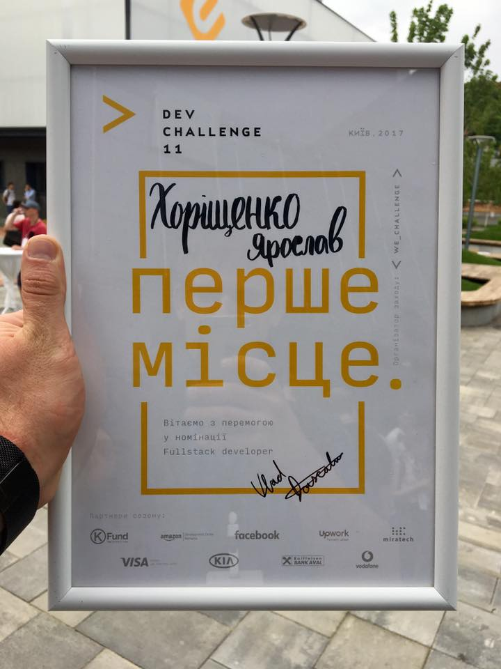

## About Me

I am an experienced programmer with a passion for building products. I have been programming since the age of 14, starting with C++ and later writing firmware for microcontrollers using assembler. I then transitioned to writing drivers with Delphi and eventually landed my first job as a C# developer. I also have experience as an iOS developer, and I am currently working as a full-stack developer.

## Education

### Kremenchuk Mykhailo Ostohradskyi National University

Master’s degree, Systems Engineering

**Period:** 2011 - 2015

**Major:** Computer sience

**Country:** Ukraine

### College of Kremenchuk National University

Junior specialist, Computer Science

**Period:** 2007 - 2011

**Country:** Ukraine

## Experience

### 🇺🇸 CircleOf - Full-stack developer

**Period:** July 2017 - Now (6 years)

**Technologies:** React, React Native, NodeJS, TypeScript, MySQL, Gatsby, Tailwind CSS

**Country:** United States

**Links:** [App Store](https://apps.apple.com/app/1298712207), [Google Play](https://play.google.com/store/apps/details?id=com.mywaysmobile), [Website](https://circleof.com/).

CircleOf is an application designed to organize assistance for individuals with health problems. It facilitates the creation of a support group comprised of family, friends, and colleagues. Once this group is established, you can add various events to the calendar, offer help, and communicate with group members. Companies can also participate in the partnership program to offer aid to their employees. Additionally, the project includes a website that publishes various tips for caring for those in need.

In the early stages of the project, I was responsible for the mobile application, which was developed using React Native. As the project evolved, all the code was eventually rewritten in TypeScript.

Subsequently, a website was developed using React and Gatsby. All content on the site is managed using GatherContent.

**Results:** apps in the [App Store](https://apps.apple.com/ua/app/family-caregiving-circleof/id1298712207), [Google Play](https://play.google.com/store/apps/details?id=com.mywaysmobile) and a [website](https://circleof.com/).


  
  
  
  
  
  
  
  
  
  
  


### 🇺🇸 Watery - Full-stack developer

**Period:** June 2021 - August 2022 (1 year, 2 months)

**Thechnologies:** React, TypeScript, NodeJS, PostgreSQL, AWS Lambda, AWS EC2, AWS S3, AWS Route53, AWS CloudFront, AWS RDS, AWS SNS

**Country:** United States

**Links:** [Website](https://watery.com/)

Watery is a website specializing in real estate located near water. With its search function, you can find listings in a selected city that meet specific criteria, such as the number of bedrooms and bathrooms, among others.

The front-end was developed using React, while NodeJS was used for the back end. To generate the list of offers, data from the provider is utilized, which is imported every night. The application actively uses various AWS services, including EC2, Lambda, S3, Route53, CloudFront, RDS, and SNS.

**Results:** the application is launched in production.


  
  
  


### 🇺🇸 BrandedAF - Full-stack developer

**Period:** лютий 2020 - червень 2021 (1 year, 4 months)

**Thechnologies:** React, React Native, Expo, JavaScript, TypeScript, NodeJS, PostgreSQL, AWS Lambda, AWS S3, AWS Cognito, AWS EC2

**Country:** United States

**Links:** [Вебсайт](https://brandedaf.com/)

BrandedAF is a software development studio specializing in assisting startups to create products from scratch. It offer a comprehensive range of services including design, development, management, and marketing.

Initially, I embarked on my journey as a front-end developer, later transitioning to a more encompassing role as a full-stack developer and project architect. My responsibilities encapsulated the following:

- Developing new application functionalities and addressing bugs.
- Scrutinizing new product designs and offering insightful suggestions.
- Formulating development tasks.
- Spearheading the development of architecture for new projects.

I have had the opportunity to work on the following projects:

- 🇬🇧 **Flow** - an mobile application that facilitates booking spaces in coworking locations or offices in London ([App Store](https://apps.apple.com/app/1560246719), [Google Play](https://play.google.com/store/apps/details?id=co.flowplaces), [Website](https://www.flowplaces.co)).
- 🇺🇸 **Captains Club** - an exclusive social network for golfers. It enables users to track their friends' progress, organize and invite friends to events, and engage in discussions through messages and comments ([App Store](https://apps.apple.com/app/1502096463), [Google Play](https://play.google.com/store/apps/details?id=club.captains.mobile&hl=en&gl=US)).
- 🇺🇸 **Iris** - a new system designed for organizing large online events.


  
  
  
  
  
  
  
  
  
  


### 🇺🇸 Nevados - front-end developer

**Period:** Feburary 2019 - December 2019 (11 months)

**Thechnologies:** React, React Native, TypeScript, NodeJS

**Country:** United States

**Links:** [Website](https://nevados.co/)

Nevados is a system for creating and managing solar power plants. It is comprised of two parts: hardware that physically adjusts the angle and rotation of solar panels, and software for remote control. Customers can register in the system, then use a map to delineate their site. Subsequently, an algorithm calculates the optimal placement, orientation, and quantity of the panels.

The main challenge lay in developing an algorithm to compute the optimal positions. All calculations occur directly in the browser and are written in TypeScript. I designed an algorithm that, utilizing extensive geometry, performed all the necessary computations.

Additionally, I created a mobile application in React Native. This app allows operators to scan the QR code on the solar panel control device, adding it to their control system.

**Results:** the system was put into operation and the mobile application was published on Google Play.


  
  
  
  
  


### 🇺🇸 Pando - Software engineer

**Period:** March 2016 - November 2018 (2 years, 9 months)

**Technologies:** AngularJS, NodeJS, Raspberry, RabbitMQ, AWS, Raspbian.

**Country:** United States

**Links:** [Website](http://getpando.com/)

Pando is a device, based on Raspberry Pi, that can be connected to a screen to customize the content displayed on it through a web panel. The device also includes a WiFi module that scans the surrounding environment and analyzes the number of active devices in its vicinity. Its primary applications are in shops and shopping centers.

I was responsible for writing the code to control the device and creating a web-based control panel using AngularJS. The Raspberry Pi, being relatively underpowered for media operations, posed some challenges. Playing content in a browser led to video glitches and freezes, necessitating optimization of the Raspbian operating system for improved media playback.

Another challenge was updating the device's firmware. We needed to prevent any new updates from breaking the device and rendering it inoperative, as this would require us to manually download the new firmware onto all customer devices. As a result, special attention was devoted to the update process. We devised a system that downloads and runs new firmware, but reverts to the previous version in case of critical errors.

**Results:** the project was finalized and successfully launched.


  
  
  
  
  
  


### 🇺🇦 Hromadske.Kremenchuk - CTO

**Period:** April 2014 - May 2017 (3 years, 1 month)

**Technologies:** React, Angular, NodeJS, MongoDB, Redis, TypeScript, Electron, C++, PHP, WordPress, Nginx, RTMP.

**Country:** Ukraine

Hromadske TV is a non-governmental organization established in late 2013, primarily aiming to deliver truthful event coverage in adherence to rigorous journalistic standards. The entity was shaped as a "public organization" to enable funding through donations and grants. The television platform gained significant popularity during the Revolution of Dignity in Ukraine in 2014. The organization was initially established in Kyiv, before making the strategic decision to create independent regional branches, including one in Kremenchuk.

I was brought on board with the mission of constructing a TV studio and the entire supporting infrastructure from the ground up, all on a tight budget. Ordinarily, a TV studio would be built using specialized equipment such as camera switchers, on-air video launchers, ticker tapes, Skype call handlers, and separate devices for internet video streaming. However, due to budget constraints, we had to find alternative solutions. Therefore, we opted to replace as much of the traditional hardware as possible with software solutions. Consequently, the initial version of the live broadcasting studio was composed of just a single computer equipped with a video stream capture card, along with cameras and a sound

I devised our unique web-based TV studio management system, which encompassed the following features:

- Title generation for broadcasts, adhering to our brand design and including a database of individuals who appeared on our broadcast.
- A continuous, on-air ticker tape that journalists could edit remotely. This ticker tape was automatically updated in real-time via WebSockets.
- A news publisher for social networks. This tool enabled journalists to draft a news item and simultaneously disseminate it across all social platforms where Hromadske TV had a presence, all with a single click.

The server side of our application was developed using NodeJS, harnessing the Sails.js framework, while the front-end was crafted using AngularJS.

Subsequently, I developed a distinct standalone application on Electron - Streamer. This application served to generate television broadcasts and was split into two windows. The first window was a calendar facilitating easy addition of videos, live broadcasts, advertisements, and provided visibility into what was currently playing on-air. The second window served as a broadcast playback window, which was captured by the computer and subsequently broadcasted on-air.

To further cut costs, I fabricated some of our own devices. For instance, I created a device to illuminate the active camera. When the on-air director engages a camera for broadcast, a red LED light above it is activated, informing the journalists where they should direct their attention. Comparable devices in the market range from $200-$300. Our custom-built solution cost merely $10.

**Results:** A fully functional TV studio was assembled from scratch, significantly under budget. I managed the setup of the studio and established the processes and procedures for the technical team. Furthermore, a TV website and a live broadcast management system were successfully implemented.


  
  


### 🇺🇦 Visnyk Kremenchuka - iOS, PHP developer

**Period:** September 2012 - May 2014 (1 year, 8 months)

**Technologies:** iOS, Objective-C, Wordpress, PHP, MySQL

**Country:** Ukraine

The Visnyk Kremenchuka is a media outlet based in the city of Kremenchuk. At the inception of our collaboration, they were publishing a weekly paper newspaper and maintaining a website. However, as the influence of the internet grew, they found their paper edition sales declining while their website readership expanded. Consequently, they decided to prioritize their online presence.

Initially, I transitioned the site to WordPress from an outdated CMS that hadn't been updated in a while. Switching to WordPress facilitated more attractive content creation, simplified news editing, enhanced content management, and enabled analytics. For load balancing, Apache and Nginx were used, and we introduced the capability to cache pages into static files.

Subsequently, the editorial team decided to develop an iOS application. Its core functions included news reading, the ability to leave comments, viewing photos and videos, and saving favorite content. To accomplish this, I developed the application in Objective-C and integrated it with the existing site using the WordPress API and my custom plugins.

**Results:** the website loading speed increased four times. The app was published in the App Store and had about a thousand users.


  
  
  
  
  
  
  
  
  
  
  
  
  
  
  


### 🇺🇦 RiverSoft - Delphi, C# developer

**Period:** March 2010 - May 2012 (2 years, 2 months)

**Technologies:** Delphi, C#, WPF, Microsoft SQL Server

**Country:** Ukraine

RiverSoft is a company specializing in the development of automated parking systems. My initial task was to augment an existing parking management system, which was written in Delphi.

After some time, we were tasked with creating an interface for parking machines, which customers would use to pay for parking and top up their cards. It was at this juncture that we decided to transition to Microsoft technologies, specifically C#, the .NET framework, and SQL Server. We developed the interface for the parking meters using WPF. This proved to be the correct decision, as the Microsoft stack facilitated quick system deployment. Thanks to WPF and XAML, we could adjust the interface's appearance with considerable flexibility.

**Results:** after replacing people with an automated system, cash theft by employees was eliminated and the client's profits doubled.

## Open source

I have [a separate page](/projects) with a list of my projects. Please visit it for more information.

### \#Kremen.Transport

Map of public transport in Kremenchuk City, Ukraine.

- **GitHub:** [Web](https://github.com/husky-dev/kremen-transport-web), [Mobile](https://github.com/husky-dev/kremen-transport-mobile), [API](https://github.com/husky-dev/kremen-api)
- **Apps:** [Web](https://transport.kremen.dev), [App Store](https://apps.apple.com/ua/app/kremenchuk-public-transport/id1600469756), [Google Play](https://play.google.com/store/apps/details?id=com.krementransport)

An application for tracking buses, trolleybuses, and minibuses in Kremenchuk, Ukraine is available. You can use it to find out the arrival time of the transport at the bus stop and view only the required routes on the map.

### \#Kremen.Equipment

Map of municipal vehicles: snowplows, sprinklers, and tractors in Kremenchuk City, Ukraine.

- **GitHub:** [Web](https://github.com/husky-dev/kremen-equipment-web), [API](https://github.com/husky-dev/kremen-api)
- **Apps:** [Web](https://equipment.kremen.dev)

### md2snipp - Markdown to VSCode snippets CLI tool

A tool for generating VSCode snippets from Markdown files.

- **GitHub:** [md2snipp](https://github.com/husky-dev/md2snipp)

### chlog-cli - Changelog generator CLI tool

CLI tool for managing `CHANGELOG.md` file based on [Keep a Changelog](https://keepachangelog.com/en/1.0.0/) format.

- **GitHub**: [chlog-cli](https://github.com/husky-dev/chlog-cli)

## Awards

### Winner of the 2017 Dev Challenge in the “Full-stack Development” category

**Website:** [https://www.devchallenge.it/](https://www.devchallenge.it/)

DEV Challenge is the largest championship for IT specialists in Europe. During 18 seasons, more than 22,000 specialists have participated in it.

