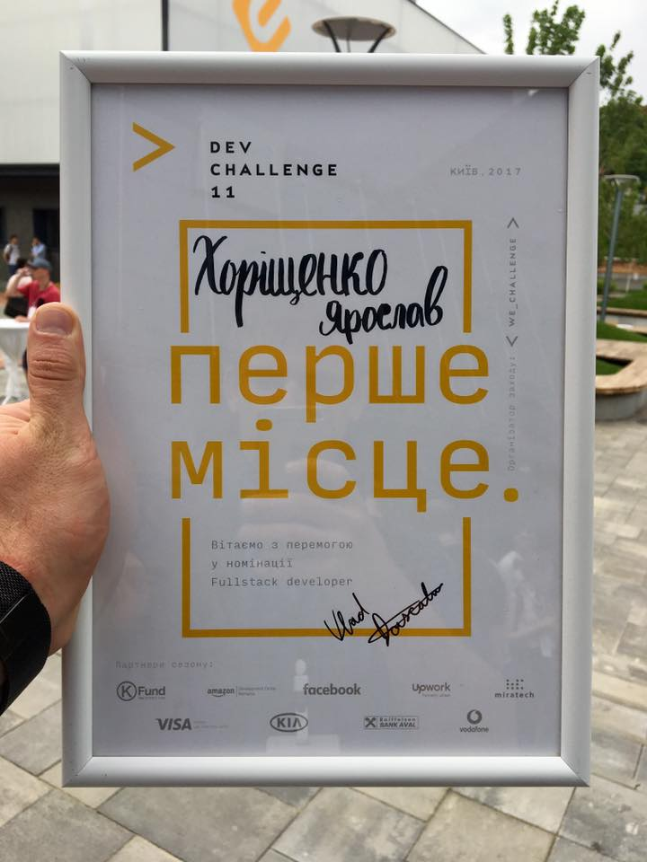

## Про мене

Мене звати Ярослав, і я займаюся програмуванням із 14 років.

Починав із написання прошивок для мікроконтролерів, використовуючи асемблер і C++. Потім я перейшов до написання драйверів за допомогою Delphi, а трохи пізніше отримав свою першу роботу як розробник C#. Після цього декілька років створював iOS-додатки, використовуючи Objective-C і Swift.

Наразі я займаюся Full Stack розробкою, адже люблю створювати додатки, починаючи з back-end частини і завершуючи інтерфейсом кінцевого користувача.

## Досвід

### 🇪🇺 Maquettica Interactive - Full Stack developer

**Період:** Жовтень 2023 - Березень 2024 (6 місяців)

**Технології:** React, React Native, NodeJS, TypeScript, C++, ESP32, PlatformIO, MongoDB Docker

**Посилання:** [App Store](https://apps.apple.com/ua/app/maquettica-interactive/id6477194066), [Google Play](https://play.google.com/store/apps/details?id=eu.maquettica.interactive), [Website](https://www.maquettica.eu/).

Maquettica - це додаток, розроблений для керування та анімування фізичних архітектурних моделей, створених [«Maquettica Architectural Models»](https://www.maquettica.eu/). Він дозволяє користувачам керувати освітленням, рухом та іншими функціями зі своїх мобільних пристроїв, що робить його ідеальним для дизайнерських презентацій, музеїв, архітекторів та девелоперів нерухомості.

Ця платформа складається з трьох частин:

- Пристрій, який керує обладнанням, базується на ESP32. Після ввімкнення він ініціює мережу WiFi з SSID та паролем, визначеними в адмін-панелі. Потім користувачі можуть підключатися до пристрою за допомогою мобільного додатку.
- Мобільний додаток підключається до пристрою через WiFi і дозволяє користувачам керувати ним. Кожен проект має свій власний стиль і брендинг, залежно від вимог клієнта.
- Адмін-панель дозволяє керувати проектами. Вона дозволяє редагувати стилі проекту, керувати конфігураціями виводу плати та завантажувати необхідну прошивку для плати.

Панель адміністратора була реалізована з використанням React, TypeScript, NodeJS, MongoDB та Docker. Мобільний додаток був розроблений з використанням React Native для підтримки платформ iOS та Android. Прошивка для контролеру була розроблена з використанням C++ та фреймворку PlatformIO.






 
 
 
 


### 🇺🇸 Singing Bowl - Full Stack developer

**Період:** October 2023 - March 2024 (6 місяців)

**Технології:** React Native, NodeJS, TypeScript, C++, Raspberry Pi, ESP32

**Країна:** США

Singing Bowl (співоча чаша) - це річ яку звичай можна побачити в буддійських храмах. Пристрій складається з плати Raspberry Pi, реле та соленоїда. Реле з'єднується з соленоїдом, який вдаряє по співочій чаші в запланований час, змушуючи її дзвеніти.

Моїм завданням було:

- Розробити пристрій за допомогою плати Raspberry Pi, включаючи необхідну схему.
- Розробити прошивку для пристрою з використанням TypeScript та NodeJS.
- Розробити мобільний додаток для платформ iOS та Android з використанням React Native.

В результаті було створено прототип пристрою та розроблено два додатки. Для зв'язку між додатком та пристроєм було обрано Bluetooth Low Energy, оскільки він швидкий та ідеально підходить для цього завдання.

Для подальшого розвитку було створено пристрій на базі плати ESP32, щоб зменшити енергоспоживання і дозволити йому працювати від акумуляторів.




 
 

### 🇺🇸 CircleOf - Full Stack developer

**Період:** липень 2017 - зараз (6 років, 2 місяці)

**Технології:** React, React Native, NodeJS, TypeScript, MySQL, Gatsby, Tailwind CSS

**Країна:** США

**Посилання:** [App Store](https://apps.apple.com/app/1298712207), [Google Play](https://play.google.com/store/apps/details?id=com.mywaysmobile), [Website](https://circleof.com/).

CircleOf - додаток для організації допомоги людині, у котрої проблеми із здоров’ям. Він допомагає створити групу з рідних, близьких, друзів та колег. Після цього можна додавати різні події до календару, пропонувати свою допомогу, переписуватись з учасниками групи. Компанії мають змогу приєднатись до партнерської програми і пропонувати допомогу своїм робітникам. Також проект має сайт, на якому публікуються різні поради щодо догляду за людьми котрі потребують допомоги.

На самому початку проекту я відповідав за мобільний додаток, котрий був створений за допомогою React Native. Під час розвитку проекту, згодом весь код був переписаний на TypeScript.

Згодом з’явився сайт написаний на React з використанням Gatsby. Весь контент редагується за допомогою GatherContent.

**Результати:** додатки в [App Store](https://apps.apple.com/ua/app/family-caregiving-circleof/id1298712207), [Google Play](https://play.google.com/store/apps/details?id=com.mywaysmobile) і [вебсайт](https://circleof.com/).


 
 
 
 
 
 
 
 
 
 
 


### 🇺🇸 Watery - Full Stack developer

**Період:** червень 2021 - серпень 2022 (1 рік, 3 місяці)

**Технології:** React, TypeScript, NodeJS, PostgreSQL, MongoDB, AWS Lambda, AWS EC2, AWS S3, AWS Route53, AWS CloudFront, AWS RDS, AWS SNS

**Країна:** США

**Посилання:** [Website](https://watery.com/)

Watery - сайт який спеціалізується на нерухомості розташованої біля води. Завдяки пошуку можна знайти пропозиції для вибраного міста із обраними характеристиками: кількість спалень, ванних кімнат, тощо.

Front-end розроблений на React. Back-end - NodeJS. Для отримання списку пропозицій використовуються дані провайдера, котрі імпортуються кожну ніч. Додаток активно використовує сервіси AWS, такі як: EC2, Lambda, S3, Route53, CloudFront, RDS, SNS.

**Результати:** додаток запущений в продакшен і виконує свої функції.


 
 
 


### 🇺🇸 BrandedAF - Full Stack developer

**Період:** лютий 2020 - червень 2021 (1 рік, 5 місяців)

**Технології:** React, React Native, Expo, JavaScript, TypeScript, NodeJS, PostgreSQL, AWS Lambda, AWS S3, AWS Cognito, AWS EC2

**Країна:** США

**Посилання:** [Вебсайт](https://brandedaf.com/)

BrandedAF - студія розробки програмного забезпечення, яка допомагає стартапам створювати продукти з нуля та надає послуги з дизайну, розробки, менеджменту та маркетингу.

Я починав як front-end розробник, а потім зайняв позицію full-stack розробника і архітектора проектів. У мої задачі входило:

- Створення нового функціоналу додатків та виправлення багів.
- Аналіз дизайнів нових продуктів та внесення пропозицій.
- Створення задач по розробці.
- Розробка архітектури нових проектів.

Я працював над наступними проектами:

- 🇬🇧 Flow - мобільний додаток, за допомогою якого можна забронювати місце в коворкінгу або офісі у Лондоні ([App Store](https://apps.apple.com/app/1560246719), [Google Play](https://play.google.com/store/apps/details?id=co.flowplaces), [Website](https://www.flowplaces.co)).
- 🇺🇸 Captains Club - закрита соціальна мережа для гравців у гольф ([App Store](https://apps.apple.com/app/1502096463), [Google Play](https://play.google.com/store/apps/details?id=club.captains.mobile&hl=en&gl=US)).
- 🇺🇸 Iris - система організації великих онлайн заходів.


 
 
 
 
 
 
 
 
 
 


### 🇺🇸 Nevados - Frontend developer

**Період:** лютий 2019 - грудень 2019 (11 місяців)

**Технології:** React, React Native, TypeScript, NodeJS

**Країна:** США

**Посилання:** [Вебсайт](https://nevados.co/)

Nevados - система для створення і керування сонячних електростанцій. Вона складається з двох частин: заліза, котре фізично керує кутом нахилу і поворотом сонячних панелей і програмного забезпечення для віддаленого керування. Клієнт має змогу зареєструватись в системі і за допомогою мапи окреслити свою ділянку. Потім алгоритм розраховує оптимальне розміщення панелей їх положення і кількість.

Основною складністю було створення алгоритму для розрахунку оптимального положення. Всі розрахунки відбуваються прямо в браузері і написані на TypeScript. Я розробив алгоритм з використанням багатої кількості геометрії, котрий проводив всі необхідні розрахунки.

Також я створив мобільний додаток на ReactNative, за допомогою якого оператор відскановував QR код на пристрої керуванні сонячною панелью і додавав його до своєї системи контролю.

**Результати:** система запущена в експлуатацію, мобільний додаток опублікований в Google Play.


 
 
 
 
 


### 🇺🇸 Pando - Software engineer

**Період:** березень 2016 - листопад 2018 (2 роки, 9 місяців)

**Технології:** AngularJS, NodeJS, Raspberry, RabbitMQ, AWS, Raspbian.

**Країна:** США

**Посилання:** [Вебсайт](http://getpando.com/)

Pando - пристрій, побудований на Raspberry Pi, котрий можна підключати до екрану і за допомогою веб панелі налаштовувати контент, котрий буде на ньому відображатись. Також девайс має WiFi модуль, котри сканує навколишнє середовище і веде аналітику кількість активних пристроїв навколо нього. Основні місця застосування - магазини і торгові центри.

Я відповідав за написання коду для керування пристроєм і створення веб панелі керування на AngularJS. Raspberry Pi відносно слабкий комп’ютер для запускання медіа. Якщо просто відтворювати контент у браузері - відео глючило і зависало. Довелось оптимізувати операційну систему Raspbian для кращого відтворення медіа.

Іншою проблемою було оновлення прошивки пристрою. Не можна було допустити, щоб нове оновлення зламало пристрій і він не міг більше функціонувати. У цьому випадку довелось би обїзжати всіх клієнтів і завантажувати нову прошивку їм на пристрій. Тому процесу оновлення було приділено особливу увагу. Була створена система котра завантажувала нову прошивку, запускала і поверталась до попередньої у випадку критичних помилок.

**Результати:** проект було доведено до готового продукту і успішно запущено.


 
 
 
 
 
 


### 🇺🇦 Hromadske.Kremenchuk - CTO

**Період:** лютий 2014 - травень 2017 (3 роки, 4 місяці)

**Технології:** React, Angular, NodeJS, MongoDB, Redis, TypeScript, Electron, C++, PHP, WordPress, Nginx, RTMP.

**Країна:** Україна

Громадське Телебачення - громадська організація, яка виникла у кінці 2013 і основною ціллю якої було правдиве висвітлення подій з урахуванням всіх журналістських стандартів. Саме для цього був обраний формат “громадської організації”, щоб мати змогу фінансуватись за рахунок донатів та грантів. Особливої популярності телебачення набуло під час Революції Гідності в Україні в 2014 році. Спочатку, організація була заснована в Києві, а потім було прийняте рішення створити незалежні регіональні відділення, в тому числі і в Кременчуці.

Я був запрошений у якості СТО щоб створити телестудію та всю інфраструктуру з нуля. У нас був дуже маленький бюджет. Зазвичай телестудію будують на основі спеціалізованих пристроїв. Наприклад, перемикання камер, запуск відео в ефір, бігуча стрічка, зідзвони в Skype, видача відеопотоку в Інтернет - для цього всього використовується окремі пристрої. Але у нас не було для цього бюджету. Тому було прийнято рішення по максимуму все замінити програмними рішеннями. В результаті перший варіант студії прямого мовлення складавася всього лише з одного комп’ютера з картою захоплення відеопотоку, камер і звукового мікшеру.

Я створив нашу власну веб-систему менеджменту телестудії, до функцій якої входило:

- Генерація титрів для ефіру з нашим брендовим дизайном і базою людей, котрі відвідували наш ефір.
- Бігуча стрічка, котра постійно прокручувалась в ефірі. Журналісти мали змогу віддалено її редагувати, а вона автоматично оновлювалась через WebSockets.
- Публікатор новин в соціальні мережі. Журналісти мали змогу підготувати новину і за допомогою одного кліка запостити її у всі соціальні мережі де було присутнє Громадське Телебачення.

Серверна частина додатку була написана на NodeJS з використанням фреймворку Sails.js. Front-end написаний на AngularJS.

Пізніше я створив спеціальний окремий додаток на Electron - Streamer, за допомогою якого можна було формувати ефір телебачення. Він складався з двох вікон. Перше вікно у вигляді календаря, в котрому можна досить просто додавати відео, прямі включення, рекламу і бачити, що зараз відтворюється в ефірі. У другому - вікно відтворення ефіру, котра потім захвачувалось комп’ютером і стрімилось в ефір.

Також, для економії, я створював власні пристрої. Наприклад пристрій для підсвічування активної камери. Коли режисер ефіру вмикає якусь камеру в ефір, над нею загоряється червоний світлодіод і журналісти знають куди їм зараз треба дивитись. На ринку такі пристрої коштують $200 - $300. Наші коштували $10.

**Результати:** була створена телестудія з нуля за значно менший кошт. Мною була зібрана студія і налаштовані процеси та процедури роботи технічної команди. Був створений сайт телебачення та система менеджменту прямого ефіру.


 
 
 
 
 


### 🇺🇦 Visnyk Kremenchuka - iOS, PHP developer

**Період:** вересень 2012 - травень 2014 (1 рік, 9 місяців)

**Технології:** iOS, Objective-C, Wordpress, PHP, MySQL

**Країна:** Україна

Вісник Кременчука - ЗМІ міста Кременчук. На початку нашої співпраці вони щотижня випускали паперову газету та мали сайт. Вони відчували, що інтернет все більше тиснить на них. Продажі паперового видання падали, а читачів сайту ставало все більше. Тому було вирішено зробити ставку на онлайн.

По перше я переніс сайт на Wordpress. До цього вони використовували стару CMS, котра доволі довго не оновлювалась. Переїзд на Wordpress допоміг створювати більш красивіші матеріали, легше редагувати новини, покращити менеджмент створення матеріалів, вести аналітику. Для балансування навантаження був використаний Apache + Nginx. Була додана можливість кешування сторінок в статичні файли.

По друге, редакція сайту вирішила створити iOS додаток. Головними його функціями було: читання новин, можливість залишити коментар, дивитись фото, відео, зберігати вподобані матеріали. Для цього я написав додаток на Objective-C, і інтегрував його з існуючим сайтом за допомогою API Wordpress і власними плагінами.

**Результати:** швидкість завантаження сайту зросло в 4 рази. Додаток був опублікований в App Store та мав близько тисячі користувачів.


 
 
 
 
 
 
 
 
 
 
 
 
 
 
 


### 🇺🇦 RiverSoft - Delphi, C# developer

**Період:** Березень 2011 - травень 2012 (2 роки, 3 місяці)

**Технології:** Delphi, C#, WPF, Microsoft SQL Server

**Країна:** Україна

RiverSoft - компанія, котра займається створенням автоматизованих паркувальних систем. Моєю початковою задачеєю було додавання функцій до вже існуючої системи менеджменту парковок, котра була написана на Delphi.

Через деякий час виникла задача створити інтерфейс для паркоматів, через які клієнти оплачують парковку та поповнюють картки. В той час ми вирішили переключитись на технології Microsoft, а саме C#, .NET framework, SQL Server. Інтерфейс для паркоматів був створений за допомогою WPF. Це було правильне рішення. Стек Microsoft дозволив швидко розгорнути систему. Завдяки WPF і XAML можна було досить гнучко редагувати зовнішній вигляд інтейфейсу.

**Результати:** після заміни людей на автоматизовану систему вдалось усунути крадіжки готівки працівниками і прибутки клієнта виросли в двічі.

## Освіта

### Кременчуцький національний університет імені Михайла Остроградського

Магістр, системна інженерія

**Період:** 2011 - 2015

**Країна:** Україна

### Коледж Кременчуцького національного університету

Молодший спеціаліст, комп'ютерні науки

**Період:** 2007 - 2011

**Країна:** Україна
## Open source

У мене є [окрема сторінка](/uk/projects) зі списком моїх проектів. Будь-ласка відвідайте її для більш детальної інформації.

### \#Кремінь.Транспорт

Карта руху громадського транспорту у місті Кременчук, Україна.

- **GitHub:** [Web](https://github.com/husky-dev/kremen-transport-web), [Mobile](https://github.com/husky-dev/kremen-transport-mobile), [API](https://github.com/husky-dev/kremen-api)
- **Додатки:** [Web](https://transport.kremen.dev), [App Store](https://apps.apple.com/ua/app/kremenchuk-public-transport/id1600469756), [Google Play](https://play.google.com/store/apps/details?id=com.krementransport)

### \#Кремінь.Техніка

Карта руху комунальної техніки, снігоприбиральників, посипальників та тракторів у місті Кременчук, Україна.

- **GitHub:** [Web](https://github.com/husky-dev/kremen-equipment-web), [API](https://github.com/husky-dev/kremen-api)
- **Додатки:** [Web](https://equipment.kremen.dev)

### md2snipp - CLI утиліта для генерації VSCode сніпетів з Markdown файлів

- **GitHub:** [md2snipp](https://github.com/husky-dev/md2snipp)

### chlog-cli - CLI утиліта генератора журналу змін

CLI-утиліта для керування файлом `CHANGELOG.md` на основі формату [Keep a Changelog](https://keepachangelog.com/en/1.0.0/).

- **GitHub**: [chlog-cli](https://github.com/husky-dev/chlog-cli)

## Нагороди

### Переможець Dev Challenge 2017 у категорії "Full-stack розробка"

**Веб-сайт:** [https://www.devchallenge.it/](https://www.devchallenge.it/)

DEV Challenge - найбільший чемпіонат для ІТ-спеціалістів у Європі. За 18 сезонів у ньому взяли участь понад 22 000 фахівців.

