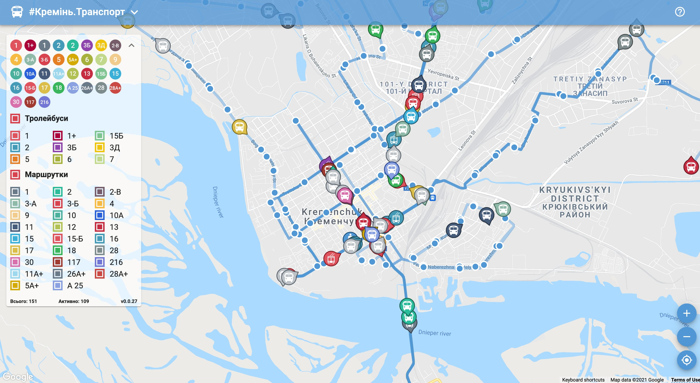
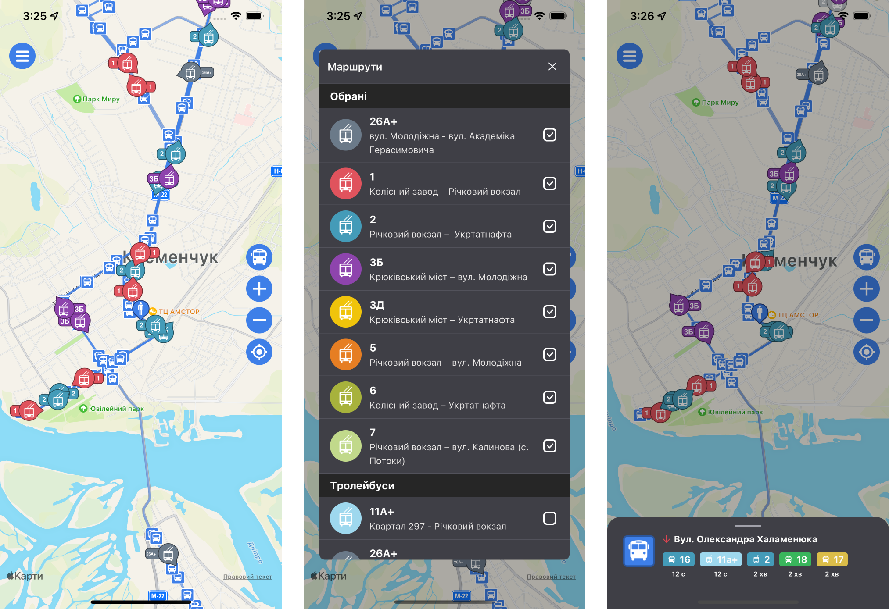
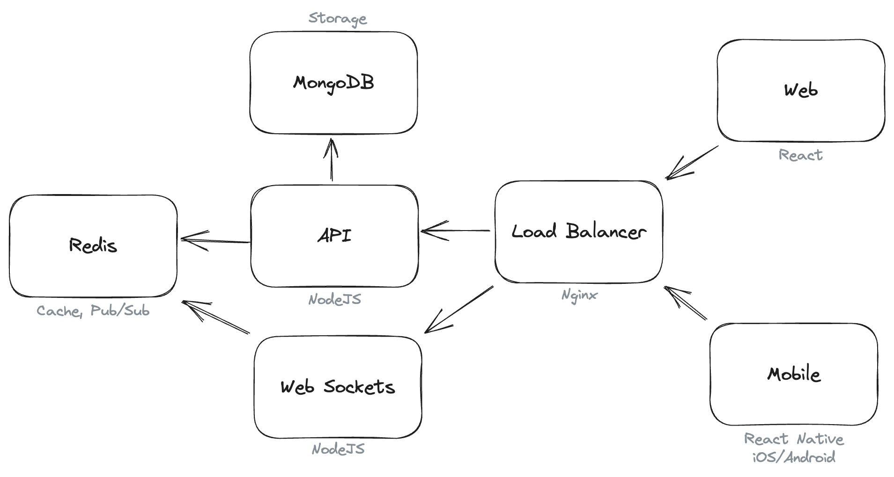

Here you will find my Open Source projects.

## #Kremen.Transport

Map of public transport in Kremenchuk City, Ukraine.

- **GitHub:** 
  - **Web:** [kremen-transport-web](https://github.com/husky-dev/kremen-transport-web)
  - **Mobile:** [kremen-transport-mobile](https://github.com/husky-dev/kremen-transport-mobile)
  - **API:** [kremen-api](https://github.com/husky-dev/kremen-api)
- **Web:** [https://transport.kremen.dev](https://transport.kremen.dev)
- **iOS:** [Kremenchuk Public Transport](https://apps.apple.com/ua/app/kremenchuk-public-transport/id1600469756)
- **Android:** [Kremenchuk Public Transport](https://play.google.com/store/apps/details?id=com.krementransport)

An application for tracking buses, trolleybuses, and minibuses in Kremenchuk, Ukraine is available. You can use it to find out the arrival time of the transport at the bus stop and view only the required routes on the map.

The project started as a pet-project that I used to test new technologies, libraries, and architectural solutions. Over time, it gained a user base and began to be used on the official website of the [Kremenchuk City Council](https://kremen.gov.ua/).

As practice has shown, the main use case arises when a user arrives at a bus stop and wants to know how long they will have to wait for the desired transport to arrive. To make this case as efficient as possible, I have optimized both the interface and the API. Upon launching the app, it immediately displays the user's current location, nearest stops, and available buses. The app then sends requests to the API, fetching the current positions of transport only for the routes selected by the user, resulting in a minimal data package sent by the back-end. Subsequently, a connection is established with the back-end using web sockets, enabling the user to receive real-time data from the server.

At the back-end, Redis is utilized for caching and Pub/Sub tasks, while transport movement logs are stored in MongoDB.

All user data and settings are stored locally, either in a browser or on a smartphone. The platform does not collect data specific to any individual. It only collects analytics related to the use of its features, without any reference to the individual user.

Technologies used:

- **Web:** React, TypeScript, ESBuild.
- **Mobile:** React Native, TypeScript.
- **API:** NodeJS, TypeScript, Docker, Docker Compose, Redis, MongoDB.

## #Kremen.Equipment

Map of municipal vehicles: snowplows, sprinklers, and tractors in Kremenchuk City, Ukraine.

- **GitHub:** 
  - **Web:** [kremen-equipment-web](https://github.com/husky-dev/kremen-equipment-web)
  - **API:** [kremen-api](https://github.com/husky-dev/kremen-api)
- **Web:** [https://equipment.kremen.dev](https://equipment.kremen.dev)

The idea for this project came up in the winter when I wanted to find out which areas are effectively cleaned of snow and which are not. The [Kremenchuk City Council website](https://kremen.gov.ua/) has a map of the movement of municipal equipment, but it doesn't allow you to view the history. Additionally, it would be nice to see a heat map of the equipment's work so you can visually see how your neighborhood was cleaned throughout the day. That's how this app came about.

It uses the same technology stack as [#Kremen.Transport](#krementransport): MongoDB for logging movements and Redis for caching data.

- **Web:** React, TypeScript, ESBuild.
- **Mobile:** React Native, TypeScript.
- **API:** NodeJS, TypeScript, Docker, Docker Compose, Redis, MongoDB.
