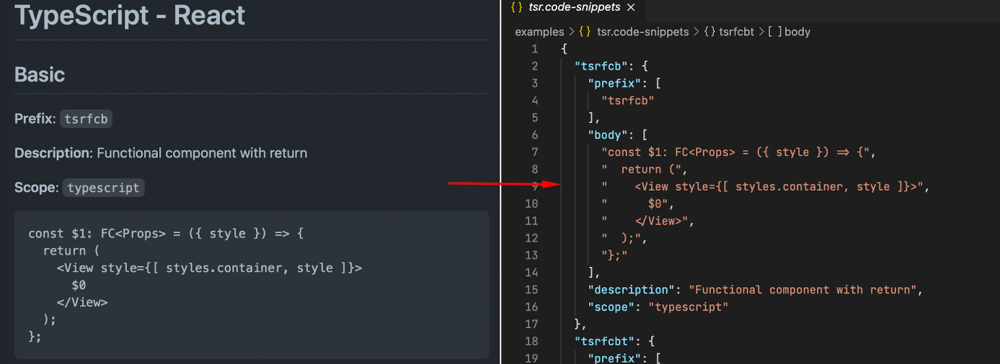
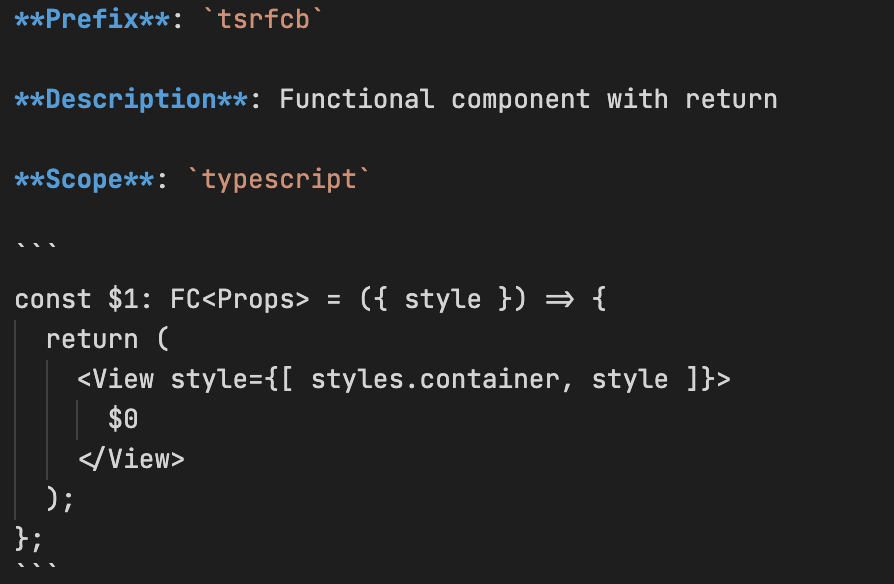

Тут ви знайдете мої Open Source проекти.

## #Кремінь.Транспорт

Карта руху громадського транспорту у місті Кременчук, Україна.

- **GitHub:** 
  - **Web:** [kremen-transport-web](https://github.com/husky-dev/kremen-transport-web)
  - **Mobile:** [kremen-transport-mobile](https://github.com/husky-dev/kremen-transport-mobile)
  - **API:** [kremen-api](https://github.com/husky-dev/kremen-api)
- **Web:** [https://transport.kremen.dev](https://transport.kremen.dev)
- **iOS:** [Кременчук Транспорт](https://apps.apple.com/ua/app/kremenchuk-public-transport/id1600469756)
- **Android:** [Кременчук Транспорт](https://play.google.com/store/apps/details?id=com.krementransport)

Додаток для відстежування руху автобусів, тролейбусів і маршруток міста Кременчук. За допомогою нього можна дізнатись час прибуття транспорту на зупинку і бачити на мапі тільки потрібні маршрути.


Проект починався як pet-проект, який я використовував для тестування нових технологій, бібліотек та архітектурних рішень. Згодом, він набрав базу користувачів та почав використовуватись на офіційному сайті [Кременчуцької міської ради](https://kremen.gov.ua/). 

Як показала практика, основний варіант використання - користувач приходить на зупинку і хоче дізнатись через скільки буде потрібний йому транспорт. Для того, щоб цей випадок був максимально ефективний, зроблені оптимізації в інтерфейсі та API. При запуску відразу відображається поточне місце положення користувача, найближчі зупинки та транспорт. Дотаток робить запити до API для отримання поточного положеня транспорту тільки обраних користувачем маршрутів, щоб back-end мав змогу відправити мінімальний пакет даних. Після цього, встановлюється зв’язок з back-end за допомогою web sockets і користувач отримує дані з серверу в реальному часі.


На back-end для кешування та Pub/Sub задач використовується Redis. Логи переміщення транспорту зберігаються в MongoDB.


Всі дані та налаштування користувачів зберігаються локально в браузері або на смартфоні. Платформа не збирає данні про конкретну людину. Збирається тільки аналітика використання функцій без прив’язки до користувача.

Використані технології:

- **Web:** React, TypeScript, ESBuild.
- **Mobile:** React Native, TypeScript.
- **API:** NodeJS, TypeScript, Docker, Docker Compose, Redis, MongoDB.

## #Кремінь.Техніка

Карта руху комунальної техніки, снігоприбиральників, посипальників та тракторів у місті Кременчук, Україна.

- **GitHub:** 
  - **Web:** [kremen-equipment-web](https://github.com/husky-dev/kremen-equipment-web)
  - **API:** [kremen-api](https://github.com/husky-dev/kremen-api)
- **Web:** [https://equipment.kremen.dev](https://equipment.kremen.dev)

Ідея цього проекту виникла взимку. Хотілось дізнатись які райони після сильних снігопадів снігоприбиральники чистять ефективно, а які не дуже.  На сайті [Кременчуцької міської ради](https://kremen.gov.ua/) є карта переміщення комунальної техніки. Але в ній немає можливості переглядати історію. Та і взагалі, було б непогано бачити теплову карту роботи техніки, щоб можна було наглядно подивитись як за добу чистили твій район. Так і виник цей додаток.


Він використовує той же стек технологій, що і [#Кремінь.Транспорт](#креміньтранспорт): MongoDB для ведення логу переміщень та Redis для кешування даних.

- **Web:** React, TypeScript, ESBuild.
- **Mobile:** React Native, TypeScript.
- **API:** NodeJS, TypeScript, Docker, Docker Compose, Redis, MongoDB.

## md2snipp - CLI утиліта для генерації VSCode сніпетів з Markdown файлів

**GitHub:** [md2snipp](https://github.com/husky-dev/md2snipp)

Сніппети - це круто! Вони допомагають економити час і зусилля програмістів. VSCode - це теж круто. Однак зберігати, керувати та редагувати багаторядкові сніпети може бути складно. Хоча формат JSON простий у використанні, перегляд і редагування фрагментів з великою кількістю рядків може стати нудним. Робота з масивами JSON, відступами і комами може відштовхнути вас від редагування фрагментів. Більше того, з часом ви можете забути деякі сніпети, і вам доведеться переглядати JSON-файл, щоб їх згадати. Щоб вирішити ці проблеми, я пропоную зберігати сніпети у зручному для читання форматі Markdown і конвертувати їх у JSON.



Встановлення:

```bash
npm isntall -g md2snipp
```

Використання. Створіть папку з файлами `.md` наступного формату:



Зазвичай я використовую для цього папку `.vscode/snippets`. Потім виконайте наступну команду:

```bash
npx md2snipp --root .vscode/snippets --output .vscode
```

Утиліта шукатиме файли `.md` у `.vscode/snippets`, перетворюватиме їх у файли `.code-snippets` і виводитиме результат у `.vscode`. Він розрізняє окремі фрагменти за ключовим словом `**Prefix**` і за блоком коду. Ви можете додати будь-який інший текст і коментарі. Утиліта шукатиме лише ключові слова і тіло сніпета.

## chlog-cli - CLI утиліта генератора журналу змін

CLI-утиліта для керування файлом `CHANGELOG.md` на основі формату [Keep a Changelog](https://keepachangelog.com/en/1.0.0/).

Встановлення: 

```bash
npm isntall -g chlog-cli
```

Або використовуйте з `npx`:

```bash
npx chlog-cli help
```

Використання. Запустити новий журнал змін:

```bash
chlog-cli init
```

Отримайте повний журнал змін:

```bash
chlog-cli get
```

Отримайте всі зміни у версії `1.50.x`:

```bash
chlog get 1.50
```

Додати запис:

```bash
chlog add -a 1.50.1 "Some new feature"
```
