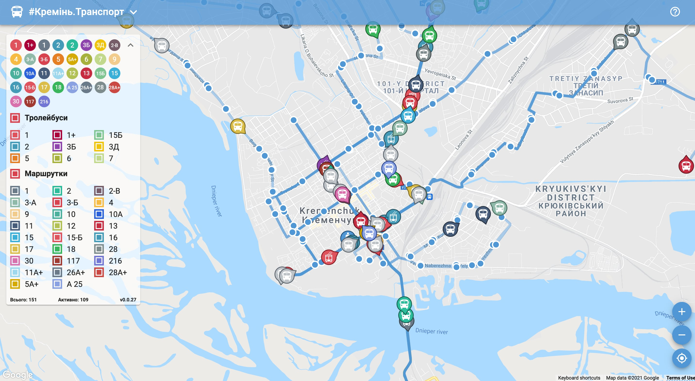
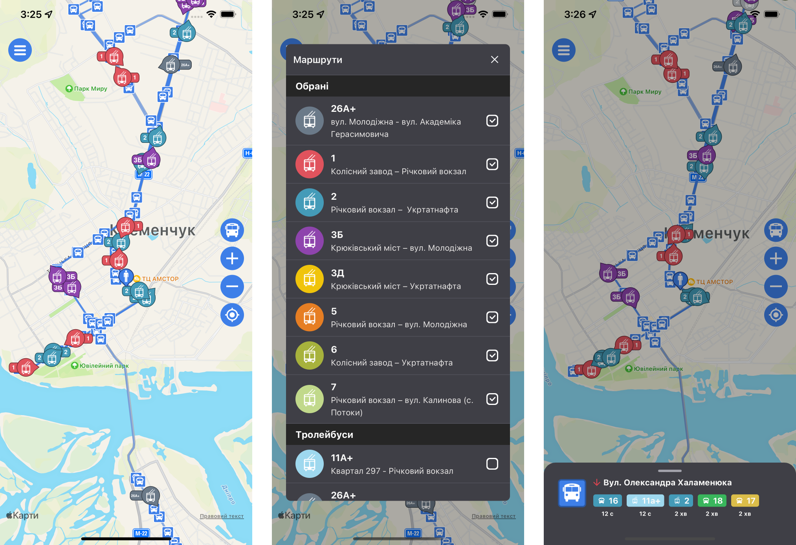
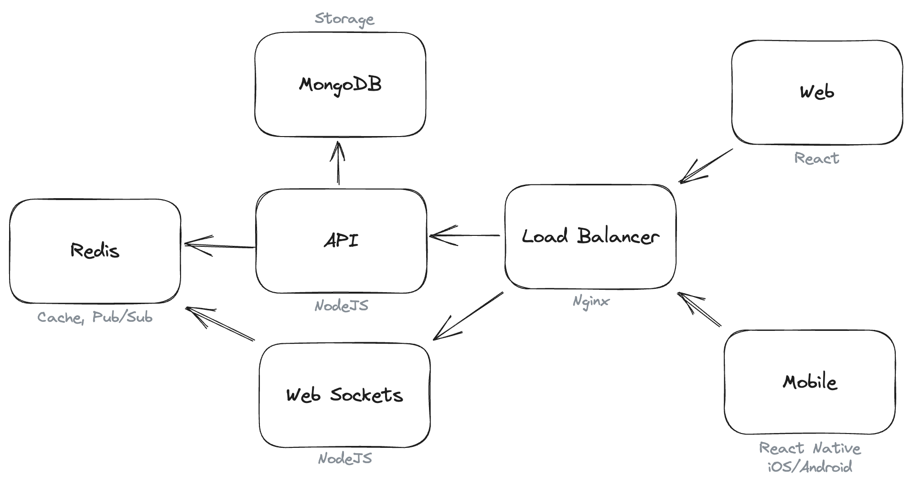

Тут ви знайдете мої Open Source проекти.

## #Кремінь.Транспорт

Карта руху громадського транспорту у місті Кременчук, Україна.

- **GitHub:** 
  - **Web:** [kremen-transport-web](https://github.com/husky-dev/kremen-transport-web)
  - **Mobile:** [kremen-transport-mobile](https://github.com/husky-dev/kremen-transport-mobile)
  - **API:** [kremen-api](https://github.com/husky-dev/kremen-api)
- **Web:** [https://transport.kremen.dev](https://transport.kremen.dev)
- **iOS:** [Кременчук Транспорт](https://apps.apple.com/ua/app/kremenchuk-public-transport/id1600469756)
- **Android:** [Кременчук Транспорт](https://play.google.com/store/apps/details?id=com.krementransport)

Додаток для відстежування руху автобусів, тролейбусів і маршруток міста Кременчук. За допомогою нього можна дізнатись час прибуття транспорту на зупинку і бачити на мапі тільки потрібні маршрути.

Проект починався як pet-проект, який я використовував для тестування нових технологій, бібліотек та архітектурних рішень. Згодом, він набрав базу користувачів та почав використовуватись на офіційному сайті [Кременчуцької міської ради](https://kremen.gov.ua/). 

Як показала практика, основний варіант використання - користувач приходить на зупинку і хоче дізнатись через скільки буде потрібний йому транспорт. Для того, щоб цей випадок був максимально ефективний, зроблені оптимізації в інтерфейсі та API. При запуску відразу відображається поточне місце положення користувача, найближчі зупинки та транспорт. Дотаток робить запити до API для отримання поточного положеня транспорту тільки обраних користувачем маршрутів, щоб back-end мав змогу відправити мінімальний пакет даних. Після цього, встановлюється зв’язок з back-end за допомогою web sockets і користувач отримує дані з серверу в реальному часі.

На back-end для кешування та Pub/Sub задач використовується Redis. Логи переміщення транспорту зберігаються в MongoDB.

Всі дані та налаштування користувачів зберігаються локально в браузері або на смартфоні. Платформа не збирає данні про конкретну людину. Збирається тільки аналітика використання функцій без прив’язки до користувача.

Використані технології:

- **Web:** React, TypeScript, ESBuild.
- **Mobile:** React Native, TypeScript.
- **API:** NodeJS, TypeScript, Docker, Docker Compose, Redis, MongoDB.
